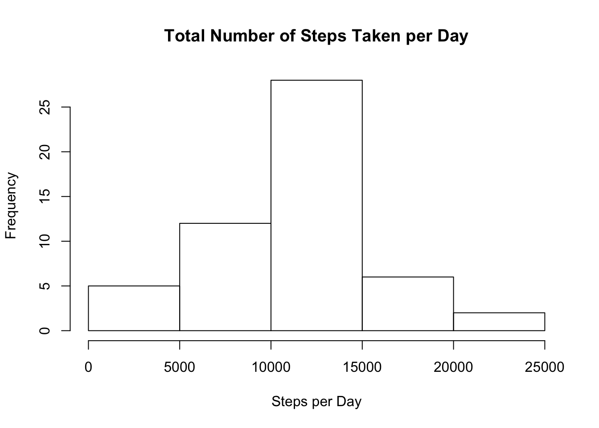
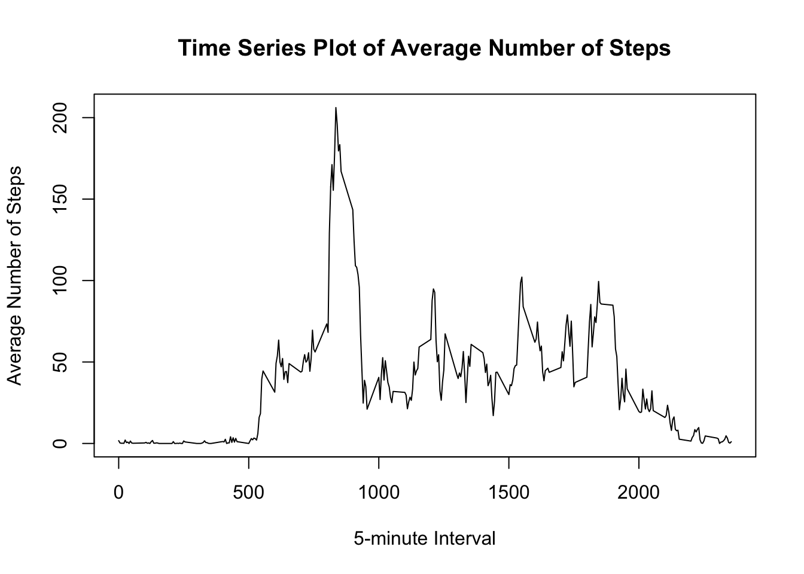
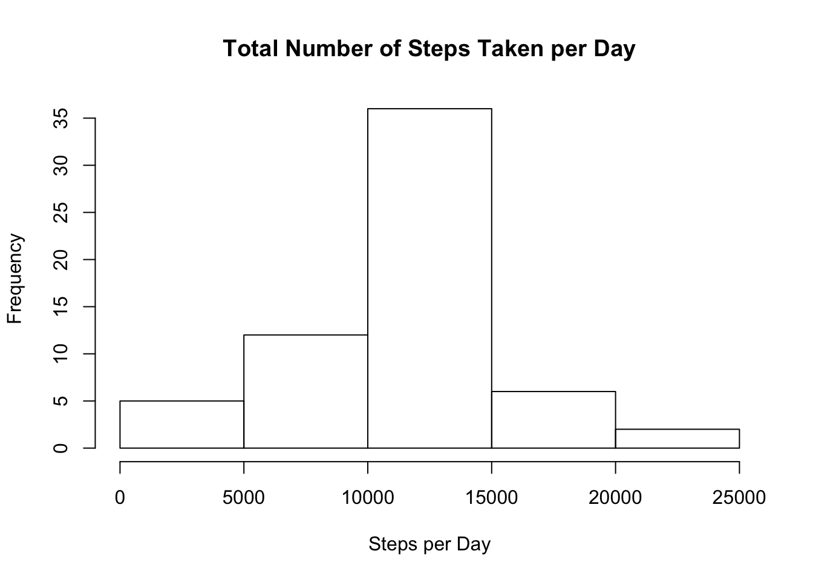
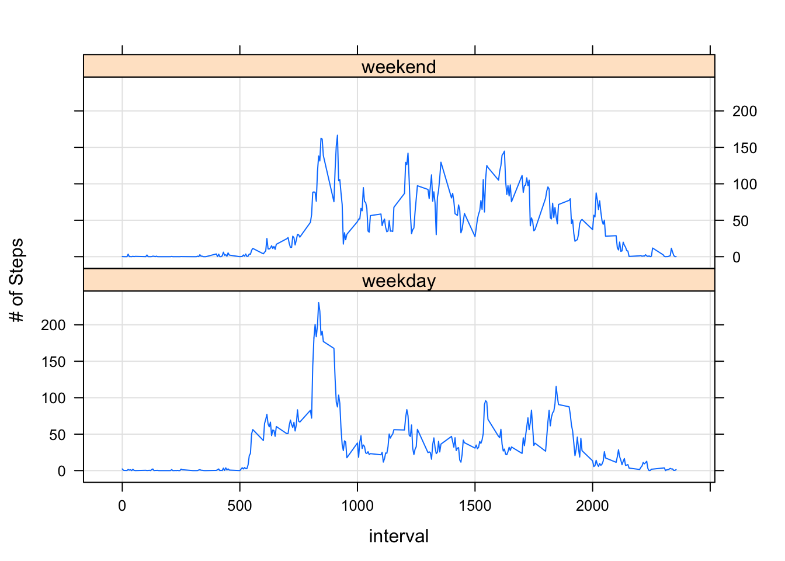

## Loading and preprocessing the data

Read in the data set.

```r
activitydata <- read.csv("activity.csv")
library(lattice)
library(knitr)
```

## What is mean total number of steps taken per day?

"1. Calculate the total number of steps taken per day."


```r
PerDay <- aggregate(steps ~ date, activitydata, sum, na.rm = TRUE)
```

"2. If you do not understand the difference between a histogram and a barplot, research the difference between them. Make a histogram of the total number of steps taken each day."


```r
hist(PerDay$steps, main = "Total Number of Steps Taken per Day", xlab = "Steps per Day")
```



"3. Calculate and report the mean and median of the total number of steps taken per day"


```r
summary(PerDay)
```

```
##          date        steps      
##  2012-10-02: 1   Min.   :   41  
##  2012-10-03: 1   1st Qu.: 8841  
##  2012-10-04: 1   Median :10765  
##  2012-10-05: 1   Mean   :10766  
##  2012-10-06: 1   3rd Qu.:13294  
##  2012-10-07: 1   Max.   :21194  
##  (Other)   :47
```
The mean number of steps per day is 10,766 and the median is 10,765.

## What is the average daily activity pattern?

"1. Make a time series plot (i.e. 𝚝𝚢𝚙𝚎 = "𝚕") of the 5-minute interval (x-axis) and the average number of steps taken, averaged across all days (y-axis)"


```r
PerInterval <- aggregate(steps ~ interval, activitydata, mean, na.rm = TRUE)
plot(PerInterval$interval, PerInterval$steps, type = "l", main = "Time Series Plot of Average Number of Steps", xlab = "5-minute Interval", ylab = "Average Number of Steps")
```



"2. Which 5-minute interval, on average across all the days in the dataset, contains the maximum number of steps?"


```r
Maximum <- which.max(PerInterval$steps)
PerInterval[Maximum, ]
```

```
##     interval    steps
## 104      835 206.1698
```
Maximum value for step average is 206.1698 and occurs at interval 835.

## Imputing missing values

"Note that there are a number of days/intervals where there are missing values (coded as 𝙽𝙰). The presence of missing days may introduce bias into some calculations or summaries of the data."

"1. Calculate and report the total number of missing values in the dataset (i.e. the total number of rows with 𝙽𝙰s)"

```r
sum(is.na(activitydata))
```

```
## [1] 2304
```

"2. Devise a strategy for filling in all of the missing values in the dataset. The strategy does not need to be sophisticated. For example, you could use the mean/median for that day, or the mean for that 5-minute interval, etc."

Replace the NA values with the mean step values for each interval found earlier in "PerInterval".

"3. Create a new dataset that is equal to the original dataset but with the missing data filled in.
Make a histogram of the total number of steps taken each day and Calculate and report the mean and median total number of steps taken per day. Do these values differ from the estimates from the first part of the assignment? What is the impact of imputing missing data on the estimates of the total daily number of steps?"

Replacing the missing data

```r
activitymodified <- activitydata
for(i in 1:nrow(activitymodified)){
        if (is.na(activitymodified$steps[i])){
                intervalno <- activitymodified$interval[i]
                newsteps <- PerInterval[
                        PerInterval$interval == intervalno,]
                activitymodified$steps[i] <- newsteps$steps;
        }
}
PerDayModified <- aggregate(steps ~ date, activitymodified, sum)
```

Histogram of the total number of steps taken each day with NA values replaced.

```r
hist(PerDayModified$steps, main = "Total Number of Steps Taken per Day", xlab = "Steps per Day")
```



Mean and median total number of steps per day with NA values replaced.

```r
summary(PerDayModified)
```

```
##          date        steps      
##  2012-10-01: 1   Min.   :   41  
##  2012-10-02: 1   1st Qu.: 9819  
##  2012-10-03: 1   Median :10766  
##  2012-10-04: 1   Mean   :10766  
##  2012-10-05: 1   3rd Qu.:12811  
##  2012-10-06: 1   Max.   :21194  
##  (Other)   :55
```
The mean number of steps per day is 10,766 and the median is 10,766. This is not much different from the mean and median without the NA values replaced. The main difference can be seen in the histogram, where the frequency is higher for 10000-15000. How much these numbers are affected may also vary with which method of replacing the NA values was used.

## Are there differences in activity patterns between weekdays and weekends?
"1.For this part the 𝚠𝚎𝚎𝚔𝚍𝚊𝚢𝚜() function may be of some help here. Use the dataset with the filled-in missing values for this part."


```r
activitymodified['day'] <- weekdays(as.Date(activitymodified$date))
activitymodified$day[activitymodified$day %in% c('Saturday','Sunday')] <- "weekend"
activitymodified$day[activitymodified$day != "weekend"] <- "weekday"
```

"2.Create a new factor variable in the dataset with two levels – “weekday” and “weekend” indicating whether a given date is a weekday or weekend day."


```r
table(activitymodified$day)
```

```
## 
## weekday weekend 
##   12960    4608
```

"3. Make a panel plot containing a time series plot (i.e. 𝚝𝚢𝚙𝚎 = "𝚕") of the 5-minute interval (x-axis) and the average number of steps taken, averaged across all weekday days or weekend days (y-axis). See the README file in the GitHub repository to see an example of what this plot should look like using simulated data."


```r
PerIntervalModified <- aggregate(steps ~ interval + day, data = activitymodified, FUN="mean")
xyplot(steps ~ interval | day, data=PerIntervalModified, type="l", layout = c(1,2), grid = T, ylab = "# of Steps")
```




